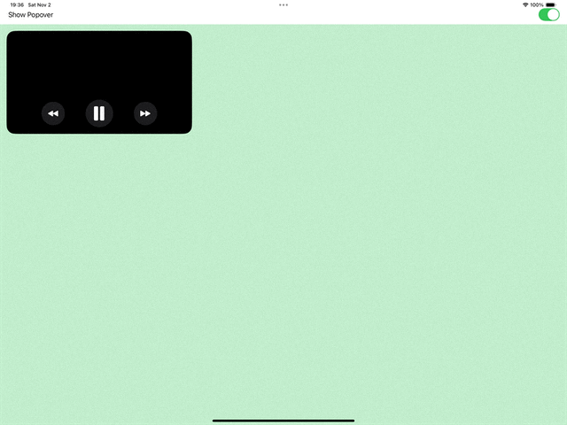

# PopoverDraggable

A SwiftUI modifier that adds a draggable popover to any view, allowing the popover to stick to the corners of the parent view, similar to the Picture-in-Picture (PiP) behavior in iOS. The popover can be moved around the screen by dragging and snaps to the nearest corner when released. Works well on iPad.




## Features

- Draggable popover that snaps to the nearest corner
- Customizable content inside the popover
- Optional action triggered when tapping outside the popover
- Automatically adjusts position to avoid covering the keyboard

## Requirements

- iOS 14.0+
- SwiftUI

## Usage

To use the `popoverDraggable` modifier, simply attach it to any SwiftUI view you want to display a popover from.


### Example

```swift
import SwiftUI

struct ContentView: View {
    @State private var isPopoverPresented = true
    @State private var popoverAlignment = Alignment.topLeading

    var body: some View {
        Color.red
            .edgesIgnoringSafeArea(.all)
            .popoverDraggable(
                isPresented: $isPopoverPresented,
                alignment: $popoverAlignment,
                outsideTapped: { print("Outside tapped") }
            ) {
                Text("Popover Content")
                    .padding()
                    .background(Color.white)
                    .cornerRadius(8)
            }
    }
}
